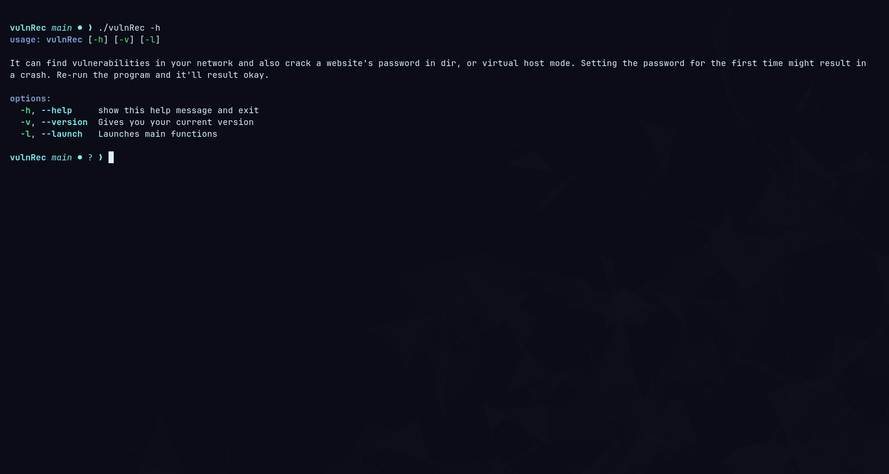

# vulnRec
Scanner for vulnerabilities in the networks or devices, as well as a simple password cracker for websites.

Cloning:
```bash
git clone https://github.com/manorossa078-dev/vulnRec.git
```


Setting it up:
```bash
cd vulnRec
chmod +x vulnRec bin/*
```


Help:
```bash
./vulnRec -h
```


Usage:
```
./vulnRec -l
...
```


It's normal to get that bug where the first time you enter a password it throws an error.
